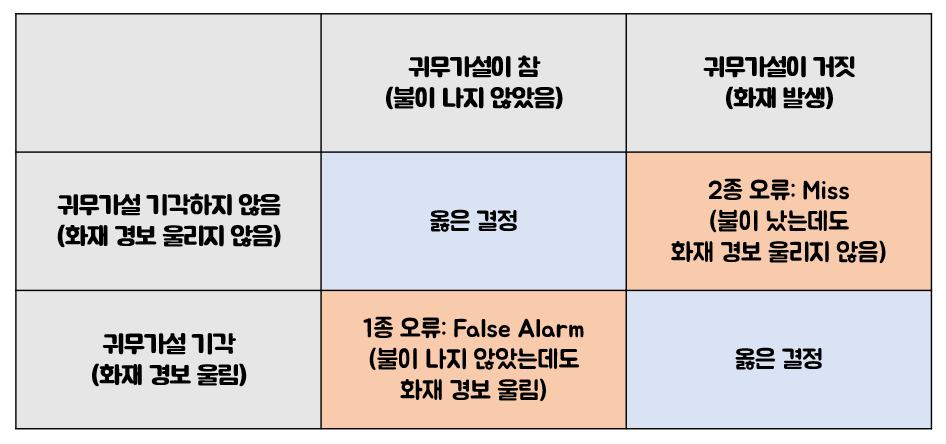
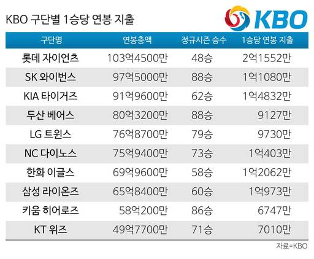
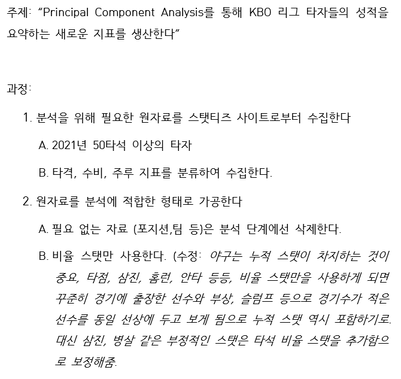
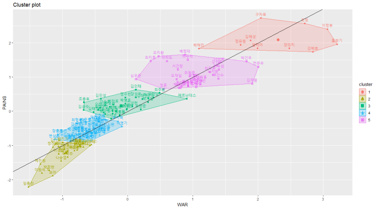

# 다변량 통계 분석으로 요약하는 2021 KBO 리그

한승헌

## Abstract

야구선수의 타격, 수비, 주루 능력을 종합적 평가하는 WAR, 타자의 타격 능력을 종합적으로 평가하는 WRC+, 투수의 방어율을 보정한 ERA+ 등, 대규모 데이터 가공과 처리가 용이해진 현 시대에 세이버 매트릭스는 새로운 전성기를 맞이하고 있다. 이제는 너무나도 유명해져 기초 통계학 수업에서는 거의 모든 교수님이 언급을 하고 넘어가는 오클랜드 애슬레틱스의 단장, 빌리 빈의 머니볼을 시작으로 미국의 메이저리그는 세이버 매트릭스로 물들게 되었다.

경영학은 산업내 변수를 통제하여 낭비를 줄이고 효율성을 극대화를 추구한다 볼 수 있다. 사실 프로야구 역시 엄연히 수요와 공급에 따라 선수의 몸값, 게임 티켓 가격, 중계권료가 결정이 되는 점에서 경영학이 크게 적용되는 스포츠 산업이다. 따라서, 감정적인 판단을 최대한 배제하여 선수의 실제 실력, 능력을 평가하여 극한의 효율성을 추구하는 세이버 매트릭스는 통계학자뿐만 아니라 경영학을 공부하는 학자들에게도 큰 관심의 대상이다. 수집, 가공, 분석, 적용의 프로세스를 통해 성공을 이룩한 빌리 빈의 머니볼은 대부분의 산업에서 참고할 만한 모델이라 볼 수 있기 때문이다.

하지만 인간이 관여하는 작업에는 감정의 영역이 무조건 작용하기 마련이다. 모든 사람이 이성적으로 내린 결정을 감정에 휩쓸려 쉽사리 이행하지 못한 경험이 있을 것이다. 머니볼 역시 마찬가지이다. 빌리 빈의 전략은 근 20년간 미디어에 노출되어 심지어 야구를 잘 모르는 사람들 역시 대략적으로 잘 알고 있을 정도이다. 하지만, 세이버 매트릭스를 기반으로 한 구단 운영을 채택한 모든 야구단의 단장이 성공을 거두는 것이 아니다. MLB를 기준으로는 오직 템파베이 레이스정도만이 머니볼의 기적을 재현했으며 매년 수 억 달러를 선수 연봉으로 지출하는 구단들이 플레이오프 마저도 진출하지 못하는 경우가 허다하다. 하지만, 매년 시행착오를 거치면서 데이터 야구는 발전을 하고 있으며 통계학도로서 이러한 변화를 연구하는 것이 매우 값진 경험이 될 것이라 매번 생각하고 있다.

기초 통계 수업을 수강하게 되면 1종, 2종 오류에 대해서 배우게 된다. 지금은 은퇴하신 한 교수님은 1종 오류에 대해서 무죄인 사람을 유죄라고 선고하는 경우이기 때문에 가장 범하지 않아야 하는 오류라 설명하셨다. 유죄인 사람을 무죄로 선고하는 실수는 피해자에게 주어져야할 정의가 실현되지 못하는 것이다. 반면, 무죄인 사람을 유죄로 선고하여 억울한 사람이 고통을 받는 것은 피해자와 억울하게 누명을 쓴 피고인 모두가 비참한 고통을 맞이하는 더욱 심각한 문제이기 때문이다. 이 얘기를 하는 이유는 바로 WAR의 순기능을 논하기 위해서이다. 세이버 매트릭스의 핵심 목표는 선수를 합리적으로 평가하여 직감이나 경험이라는 비교적 불완전한 평가로 인해 저평가되는 선수를 최대한 막는 것이다. 수 십년간 타자는 가장 소화하기 편한 (이해하기 편한) 지표인 타율, 홈런, 타점 등 클래식 스탯으로 줄 세워졌으며 투수 역시 마찬가지이다. 그러나 야구는 수비, 주루, 타격 등을 포함해 쉽게 수치화하기 힘든 사건들이 작용하여 플레이가 이루어지는 스포츠이다. 따라서, 팀의 승리에 가장 크게 기여한 선수가 오히려 저평가되는 경우가 허다하였다. 반면, 타자의 수비, 주루, 타격 능력을 가중치를 두어 종합적으로 평가하는 WAR는 클래식 스탯에서 볼 수 없는 기여를 했던 선수들의 진정한 가치를 산출하고 있다. 개인적으론 이 WAR이 통계적으론 1종 오류인 선수의 저평가를 막아주는 훌륭한 지표라 생각하고 있다. 세이버 매트릭스는 정교한 데이터를 생산하는 것에 만족해서는 안된다. 적어도 야구계에서 좋은 분석이란 해석하기 쉽고, 적용하기 쉬우면서 대부분이 그 결과에 납득할 만한 정교한 데이터를 생산하는 것이다. 그러한 관점에서, WAR은 매우 훌륭한 지표이다. 1종 오류를 비교적 최소화하는 경향이 있을 뿐만 아니라 (비록 잘못 생산된 경우에는 그렇지 않지만) 읽는 사람이 이해하기 너무나도 쉽기 때문이다. 수 십 개의 정교한 스탯이 단 하나의 실수로 요약이 되기 때문에 선수 간의 우위를 판단하기 너무나도 쉽다.

한국 프로야구 역시 몇 년 전부터 데이터 야구 붐이 불어 각 팀의 단장과 감독이 다양한 시도를 하고 있지만 키움 히어로즈를 제외하곤 눈에 띄는 성과를 거둔 팀은 없다. 물론 새로운 변화가 자리잡기 위해서는 계도기간이 필요하기 때문에 벌써부터 데이터 야구의 성패를 논하기는 이르다. 하지만, 야구는 그동안 직감과 경험이 크게 작용했던 스포츠인만큼 그 저항 역시 만만치 않았다. 그러나, 4,5년 전만해도 선수 평가에 아주 핵심적인 지표로 활용되었던 득점권 타율은 현재 통계 검정을 통해 유의한 지표가 아니라는 결론이 나올 정도로 현재 기존의 흐름은 바뀌고 있다.

미국의 스포츠 산업은 한국과 비교했을 때 모든 면에서 규모가 크다. 따라서, 스포츠 통계 분석 역시 미국이 선도하고 있으며 다양한 방법론을 통해 다양한 통계 지표가 시시각각 탄생하고 있다. 필자는 항상 다변량 통계 분석 방법의 차원 축소 개념을 활용하여 수 많은 야구 스탯을 요약하면 과학적으로 유의한 지표를 생산할 수 있지 않을까 추상적으로 고민해왔다. PAINS 동아리의 2021년 여름 방중 프로젝트 그룹에서 다른 부원들과 함께 이러한 호기심을 어느정도 해결해보고자 PL 선수들의 가치를 요인 분석 (Factor Analysis)을 진행한 적이 있다. 포지션 별로 고려해야하는 스탯이 너무 방대했던 점과 통계 지식이 미천한 탓에 최종 결과에는 아쉬움이 많이 남았지만 상당히 발전 가능성이 높은 주제라 생각했다. (자세한 내용은: [https://blog.naver.com/painsports/222449331580](https://blog.naver.com/painsports/222449331580))

아쉬움을 잔뜩 남겨둔 채 일상을 이어 나가던 와중 PCA를 응용하여 메이저리그 선수들의 활약을 새로운 지표로 수치화한 논문을 찾게 되었다 (Tung, 2021) *URL: https://vixra.org/pdf/1205.0104v1.pdf*. 이 논문은 PCA를 통해 차원 축소를 한 후 factor score을 계산하여 과거와 현역 메이저리그 선수들의 활약을 다시 수치화하여 나열하였다. 어찌 보면 단순하지만, 지난 여름 진행했던 프로젝트 그룹에서 필자의 방법론의 문제의 해답도 여럿 찾을 수 있었다. 또한, 현재 2021년 KBO 리그 정규시즌이 종료된 시점에서 이런 논문을 읽으니 다변량 분석을 통한 선수의 활약 측정이라는 숙원 사업을 완성하기에 시기적으로도 적합해 보였다.

---

## 본격적인 시작에 앞선 계획

.png)

# **추가 설명**

- 분석 과정에서 단위의 영향을 제거하기 위해 각 스탯 변수는 정규화 (관측치-관측치의 변수 평균)/(관측치의 표준 편차 or 오차) 되었다. 따라서, 이후 분석을 통해 탄생한 PC score값은 2021시즌 내에서 선수의 “상대적”인 활약을 보여주는 수치이다. 분석을 통해 도출된 공식은 2021년도 기록에 한하여 사용될 수 있으며 다른 연도에 적용을 하고 싶다면 해당 연도의 자료를 위와 같은 프로세스를 거쳐 분석해야할 것이다.
- 희생타 (변수명: SAC)은 PCB1에서 음수의 loading을 갖는다 (타석당 삼진, 병살 개수 역시 당연히 음수). 따라서, 2021년에는 희생타는 오히려 선수 평가에 부정적인 요인으로 작용한 것이다.
- PC score를 선형결합하여 얻은 단일 변수 값은 PAINS(Perfomance Analysis INduced Statistics)로 칭한다.

---

# 결과 분석

X축을 WAR, y축을 PAINS로 하여 진행한 5-Means Clustering의 결과 그래프

우선 클러스터링의 결과를 보자면, y=x선 밑에 있는 선수들의 이름이 눈에 띈다. (참고로 y=x 선 밑에 있는 선수들은 WAR에 비해 PAINS의 값이 낮게 나왔다고 보면 되며 선 상에 있는 선수들은 WAR과 PAINS의 분석 결과가 거의 일치한 선수들이다. ) 선과 최단 거리가 가장 크게 차이 나는 선수 중 홍창기, 강백호, 김재환, 페르난데스가 가장 눈에 띄는데 이 선수들의 공통점은 빈약한 수비력이다.

.png)

이 선수들의 타격 능력을 가장 많이 나타내는 PCB1의 경우, 강백호, 김재환, 페르난데스, 홍창기는 각각 1위,8위,14위, 6위지만, 종합적인 능력을 평가하는 PAINS는 10위, 20위권 밖, 40위권 밖, 5위이다. (홍창기 선수는 주루 능력에서 크게 만회를 하면서 종합적으론 순위가 올라갔다).

반면, y=x 선 상 매우 위에 있는 선수들은 수비 혹은 주루 혹은 둘다 매우 뛰어난 선수들이다. 대표적으로 오지환, 구자욱, 배정대, 박해민이 있는데 이 선수들은 모두 주루와 수비 스탯이 매우 빼어났다.

## PAINS 스코어 결과 선수별 세부 분석

.png)

KBO 리그 2021 시즌 타자 PAINS 스코어 탑 10

1. PAINS 스코어 상 올해 리그에서 가장 빼어난 활약을 보인 선수는 구자욱이다. 18시즌 이후 다소 더딘 성장을 보이던 구자욱 선수는 올해 20-20을 기록하며 커리어 하이로 뽑을 수 있는 시즌을 보냈다. 주목할 것은, 올해 구자욱 선수는 RAA 주루 기록에서 리그 5위를 기록하며 베이스 상에서 상대팀을 효과적으로 괴롭혔다. 수비 역시 발전한 모습을 보이며 500이닝 이상 수비를 나선 풀타임 우익수 중에서는 3위를 기록하였다. 타격 기록 자체도 훌륭했지만 뛰어난 주루 능력, 준수한 수비 능력을 갖추며 5툴 플레이어의 모습을 과시한 구자욱 선수가 1위에 뽑히게 된 것이다.
2. PAINS 스코어 상위 10명 중 WAR 순위 대비 가장 큰 상승폭을 기록한 것은 삼성 라이온즈의 중견수 박해민 선수이다. 올해 커리어 평년보다 압도적으로 좋은 시즌을 보낸 박해민 선수는 예년보다 수비 기록이 하락했지만 여전히 리그 13위 수준의 훌륭한 수비 능력을 보여줬으며, 주루 기록인 RAA주루 스탯에선 리그 10위를 기록하며 타격, 수비, 주루 모두 훌륭한 기록을 보여주며 시즌을 끝마쳤다. 특히, 박해민 선수는 PCB1 (타격 능력)에서는 리그 30위권 밖이었지만, 주루/도루 능력에서는 2위를 기록하며 PAINS 스코어에서 아주 크게 만회하였다.
3. 양의지 선수는 리그 2위 급 타격 능력을 보였지만 올해 포수 출장이 적은 관계로 예년에 비해 RAAwithADJ가 (포지션 조정을 한 수비 득점 기여) 1/4로 줄어들며 PAINS 스코어에서는 WAR에 비해 순위가 하락하였다.

WAR 순위 상으론 10위 권에 들었던 선수 중 김재환, 전준우 선수는 PAINS 순위가 19위, 32위로 하락하였다. 두 선수는 PCB1 기록 상에선 당연하게 7,8 위를 기록하였지만 두 선수 모두 수비 기록에서 큰 감점이 있었다 (수비 능력 PCD1 뒤에서 5,6위).

.png)

선수 별 PCB, PCD, PCR, WAR, PAINS 점수와 Cluster 구분. 클러스터의 경우, 클러스터 1과 5는 각각 티어로 따지면 1, 2티어이다

PAINS 스코어 상에서 상위권을 기록한 선수 리스트에서 눈에 띄는건 최지훈 선수이다. 작년에 데뷔하여 프로 2년차를 좋은 성적으로 마무리한 최지훈 선수는 올해 수비와 주루 부문에서 리그 다섯 손가락 안에 들어가는 활약을 보였다. PCD1의 경우 포지션 보정이 들어간 RAAwithADJ를 포함하여 가장 높은 보정치가 주어지는 유격수 플레이어들이 유리한 기록이다. 그러나, 최지훈 선수는 중견수로서 수비 능력에서 리그 4위를 기록하며 동 포지션에선 가장 좋은 수비 기록을 보여줬다. 이는 처참한 타격 능력을 가졌지만 수비로 주전 자리를 유지하고 있는 김민성 선수와 비슷한 기여도이며 실로 놀라운 결과가 아닐 수 없다.

이외에도 배정대, 오지환, 서건창 (놀랍게도 올해 수비 능력은 그리 나쁘지 않았으며 주루 능력 역시 7위를 기록함), 마차도 등 타격 기록은 다소 뒤쳐지지만 수비와 주루가 모두 뛰어난 선수들이 WAR에 비해 높은 PAINS 스코어를 기록하였다.

.png)

리그 최악의 퍼포먼스를 보여준 선수들은 나이가 어린 유망주 혹은 은퇴를 앞둔 베테랑으로 구성이 되었다. 이 중 LG의 대체 용병인 보어는 널리 알려진 악명만큼이나 처참한 PAINS score를 기록하였다. 괄목할만한 점은, 한화 이글스는 타자 파트의 리빌딩이 어느정도 가속이 붙어 노시환, 정은원, 김태연, 하주석 같은 유망주들이 자리를 잡았지만, 그 외의 타자들 중 3명이 PAINS 스코어 워스트 10에 이름을 올렸다. 코어급 유망주들의 포텐은 터졌지만 그 외의 중간 다리 역할을 해야하는 20대 후반, 30대 초반 선수들이 전멸하며 벌어진 결과가 아닌가 생각이 든다. 또한, 키움 히어로즈 역시 이정후 김혜성이 엄청난 활약을 했지만 뒤를 받쳐주는 선수가 부족했음을 알 수 있다.

---

## **그 외 선수들**

.png)

 티어 3

티어 1,2는 앞선 테이블에서 보여주었다. 티어 3의 상위권에는 의외의 인물들이 이름을 올렸는데 이 중 타격 성적은 매우 처참하지만 수비 하나로 이 리스트에 이름을 올린 김민성 선수가 눈에 띈다.

.png)

상단의 이재원은 랜더스의 포수 이재원

티어 4부터는 올해 부진했다 하기에는 무리지만 다소 아쉬웠던 선수들의 이름이 보이기 시작한다. 류지혁 선수는 올해 나쁘지 않은 타격 성적을 기록하였으나, 1루수로서의 그리 좋지 못한 수비와 고질적인 햄스트링 부상으로 인한 주루 능력 저하가 상대적으로 WAR보다 박한 PAINS 스코어로 이어졌다.

.png)

대망의 5티어는 각 팀 팬의 복장을 터지게 하는 선수들의 이름이 대거 등장한다. 작년 최고의 타자 중 한명이었던 라모스, 드디어 포텐이 터진 듯 했던 김동엽의 이름이 눈에 띈다. 허도환 선수는 올해 포수로서 나쁘지 않은 타격 성적과 빼어난 수비 능력을 보여줬으나 최악의 주루 능력으로 인해 다소 스코어에 타격을 입었다. 포수라는 포지션의 특성을 감안하면 한 티어 정도 위로 상향이 되어도 좋을 것 같다.

---

# 골든글러브 예측 (2021년 12월 4일 작성)

## 외야수

타격

외야수 부문은 후보가 제일 많기 때문에 매년 골든글러브 경쟁에서 가장 접전이다. 수상자를  예상하기 위해, 다변량 분석을 이용하여 타격, 수비, 종합 스탯의 상위 3위에 위치한 선수를 필터링하고자한다.

<aside>
💡 이정후 구자욱 홍창기

</aside>

.png)

## 외야수

수비

.png)

<aside>
💡 최지훈 배정대 박해민

</aside>

수비능력만을 감안하면 최지훈, 배정대, 박해민 선수가 수상하게 된다. 배정대 박해민 선수는 역시 이름값 만큼이나 좋은 수비 기록을 남겼고 최지훈 선수는 김강민을 이은 팀의 든든한 수비수로 외야수로 자리를 지킬 것으로 보인다.

---

# 한계

한 개의 연도를 대상으로 분석을 진행하였기 때문에 "상대적"인 선수의 퍼포먼스를 보여주는 것에 그친다는 한계가 있다.

타격 능력 같은 경우 상당히 다양하고 검증이 비교적 잘 된 변수를 사용할 수 있었지만 수비 스탯의 경우 논란이 많은 부분이기 때문에 편향이 발생할 수 밖에 없다. (주루 기록 역시 마찬가지)

PCB,PCD,PCR을 하나의 지표로 선형결합하기 위해 FA 분석을 이용했지만, 각각의 PC는 이미 서로 uncorrelated되어 있기 때문에 가중치를 얻는다는 점 외에는 분석을 통해 유의미한 결과를 얻을 수 없다.

수비 기록의 경우 원자료에서 포지션 별 가중치 이루어진 기록을 사용하였지만, 지명타자에게 가해져야하는 페널티가 조금 더 있어야 할 것 같다. 한국의 경우 정말 특수한 경우를 제외하고 고정지타 롤을 수행하는 선수가 없다. 따라서, 지타로 출장한 경기가 많을수록 다른 선수에 비해 스코어가 낮아지는 보정이 필요해 보인다.

작성자: 한승헌
